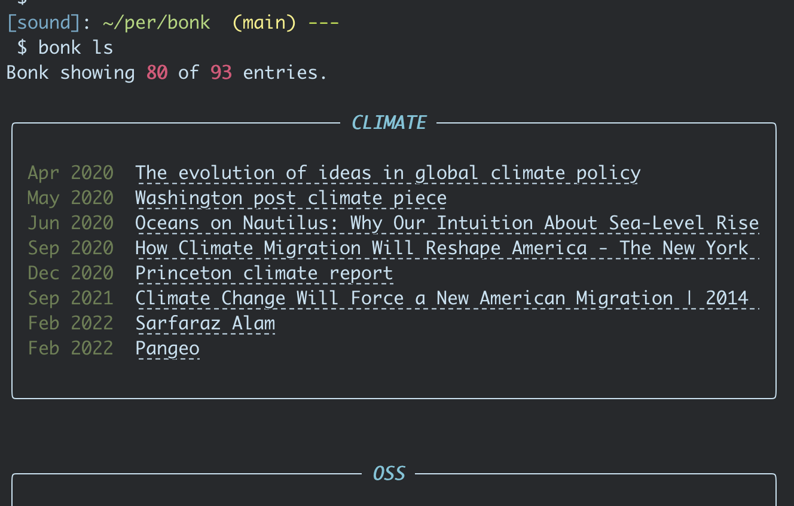

# bonk
Bonk is a simple bookmark manager. It is written to be a simple as can be
alternative to a tool like [Pocket](https://getpocket.com/). For now, `bonk`
contains only the backend to store and hold on to bookmarks. I may later create
a simple web UI.

I recently found [pocket-cli](https://github.com/rakanalh/pocket-cli) and will almost certainly be drawing inspriration from here.



## API
```
# Articles
bonk ls  # list saved pages by tag, date, title, url
bonk add # will prompt for metadata

# Tags
bonk tags ls
```
